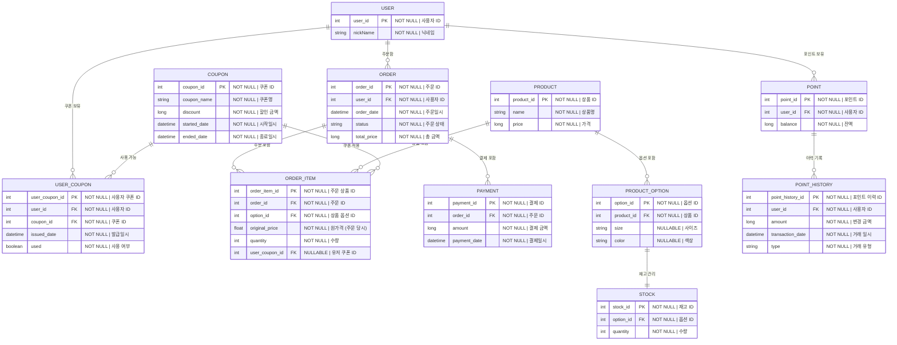

## ERD

```mermaid
erDiagram
    
    USER ||--o{ ORDER : "주문함"
    USER ||--o{ POINT : "포인트 보유"
    USER ||--o{ USER_COUPON : "쿠폰 보유"
    
    ORDER ||--o{ ORDER_ITEM : "주문 포함"
    ORDER ||--o{ PAYMENT : "결제 포함"
    
    PRODUCT ||--o{ ORDER_ITEM : "상품 포함"
    PRODUCT ||--o{ PRODUCT_OPTION : "옵션 포함"
    PRODUCT_OPTION ||--|| STOCK : "재고 관리"
    
    COUPON ||--o{ USER_COUPON : "사용 가능"
    COUPON ||--o{ ORDER_ITEM : "쿠폰 적용"
    
    POINT ||--o{ POINT_HISTORY : "이력 기록"
    
    USER {
        int user_id PK "NOT NULL | 사용자 ID"
        string nickName "NOT NULL | 닉네임"
    }
    
    ORDER {
        int order_id PK "NOT NULL | 주문 ID"
        int user_id FK "NOT NULL | 사용자 ID"
        datetime order_date "NOT NULL | 주문일시"
        string status "NOT NULL | 주문 상태"
        long total_price "NOT NULL | 총 금액"
    }
    
    ORDER_ITEM {
        int order_item_id PK "NOT NULL | 주문 상품 ID"
        int order_id FK "NOT NULL | 주문 ID"
        int option_id FK "NOT NULL | 상품 옵션 ID"
        float original_price "NOT NULL | 원가격 (주문 당시)"
        int quantity "NOT NULL | 수량"
        int user_coupon_id FK "NULLABLE | 유저 쿠폰 ID"
    }
    
    PAYMENT {
        int payment_id PK "NOT NULL | 결제 ID"
        int order_id FK "NOT NULL | 주문 ID"
        long amount "NOT NULL | 결제 금액"
        datetime payment_date "NOT NULL | 결제일시"
    }
    
    PRODUCT {
        int product_id PK "NOT NULL | 상품 ID"
        string name "NOT NULL | 상품명"
        long price "NOT NULL | 가격"
    }
    
    PRODUCT_OPTION {
        int option_id PK "NOT NULL | 옵션 ID"
        int product_id FK "NOT NULL | 상품 ID"
        string size "NULLABLE | 사이즈"
        string color "NULLABLE | 색상"
    }
    
    STOCK {
        int stock_id PK "NOT NULL | 재고 ID"
        int option_id FK "NOT NULL | 옵션 ID"
        int quantity "NOT NULL | 수량"
    }
    
    COUPON {
        int coupon_id PK "NOT NULL | 쿠폰 ID"
        string coupon_name "NOT NULL | 쿠폰명"
        long discount "NOT NULL | 할인 금액"
        datetime started_date "NOT NULL | 시작일시"
        datetime ended_date "NOT NULL | 종료일시"
    }
    
    USER_COUPON {
        int user_coupon_id PK "NOT NULL | 사용자 쿠폰 ID"
        int user_id FK "NOT NULL | 사용자 ID"
        int coupon_id FK "NOT NULL | 쿠폰 ID"
        datetime issued_date "NOT NULL | 발급일시"
        boolean used "NOT NULL | 사용 여부"
    }
    
    POINT {
        int point_id PK "NOT NULL | 포인트 ID"
        int user_id FK "NOT NULL | 사용자 ID"
        long balance "NOT NULL | 잔액"
    }
    
    POINT_HISTORY {
        int point_history_id PK "NOT NULL | 포인트 이력 ID"
        int user_id FK "NOT NULL | 사용자 ID"
        long amount "NOT NULL | 변경 금액"
        datetime transaction_date "NOT NULL | 거래 일시"
        string type "NOT NULL | 거래 유형"
    }
```