# 1. 기능 설계 및 프로세스 흐름

## 1-1 포인트 조회

### 플로우 차트
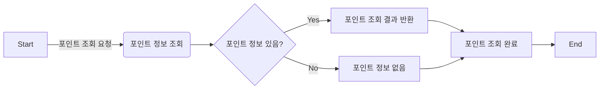

### 시퀀스 다이어그램


## 1-2 포인트 충전
### 플로우 차트
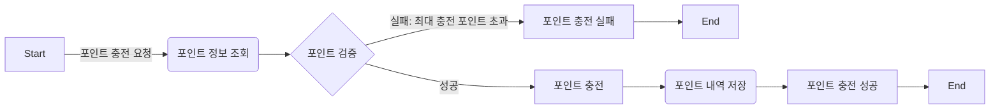

### 시퀀스 다이어그램
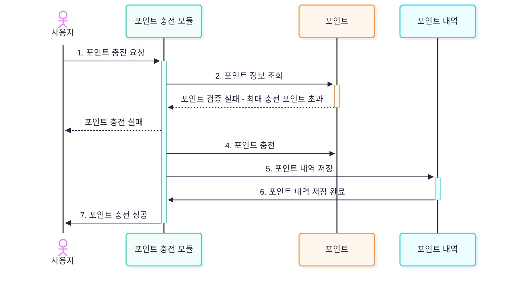
## 1-3 포인트 내역 조회

### 플로우 차트
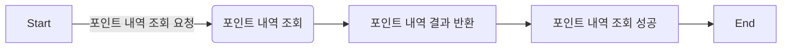

### 시퀀스 다이어그램
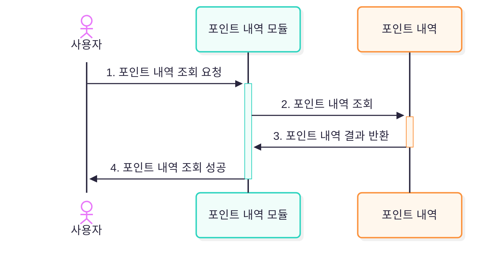

## 1-4 상품 조회

### 플로우 차트
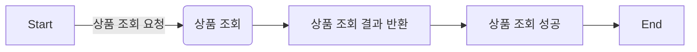

### 시퀀스 다이어그램
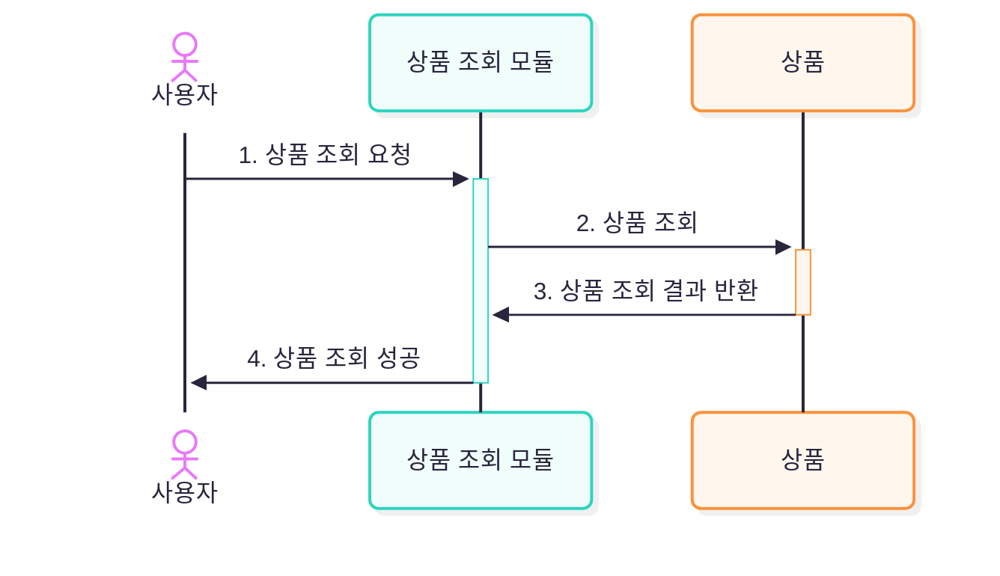
## 1-5 판매 우수 상품 조회

### 플로우 차트
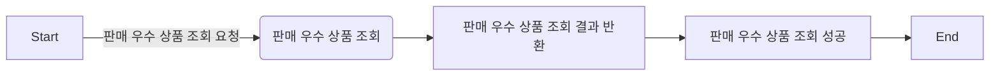

### 시퀀스 다이어그램
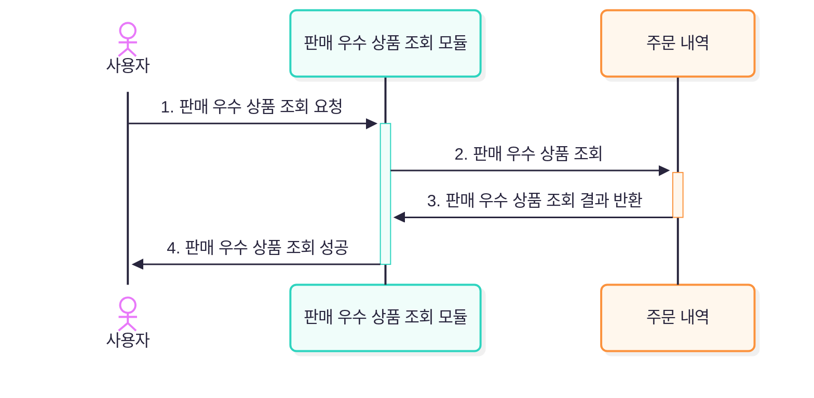

## 1-6 상품 주문

### 플로우 차트
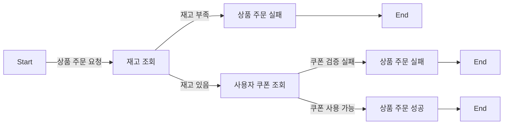

### 시퀀스 다이어그램
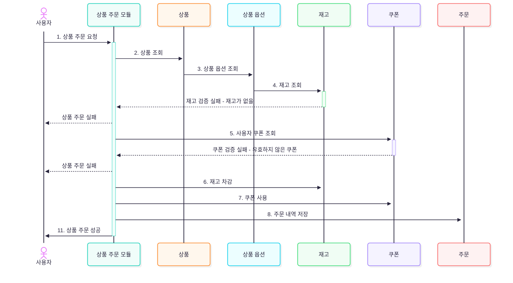

## 1-7 주문 내역 조회

### 플로우 차트
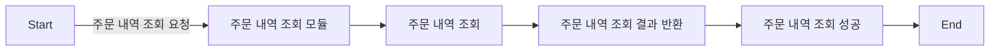

### 시퀀스 다이어그램
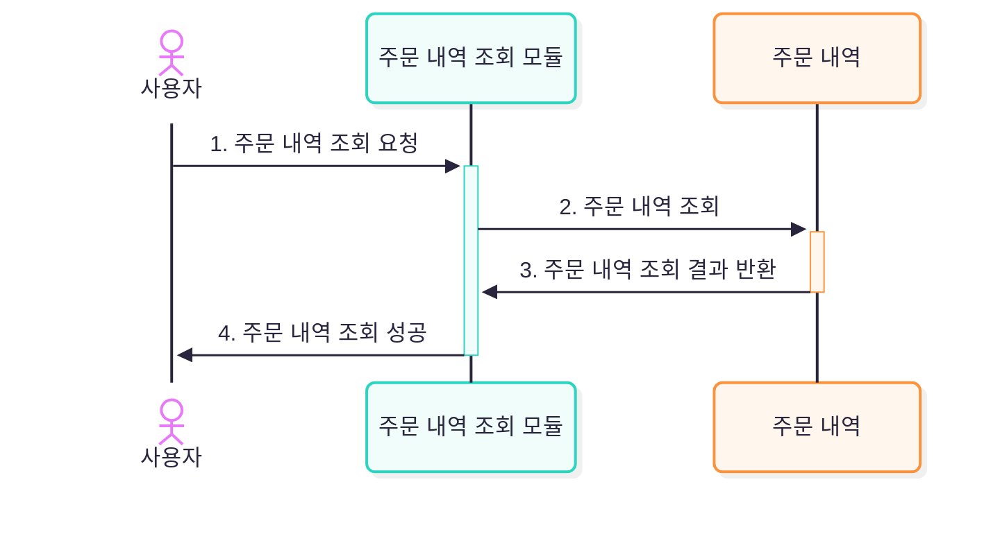

## 1-8 주문 상세 내역 조회

### 플로우 차트
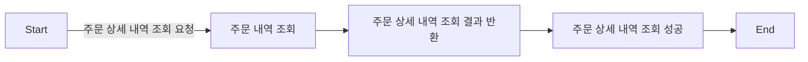

### 시퀀스 다이어그램
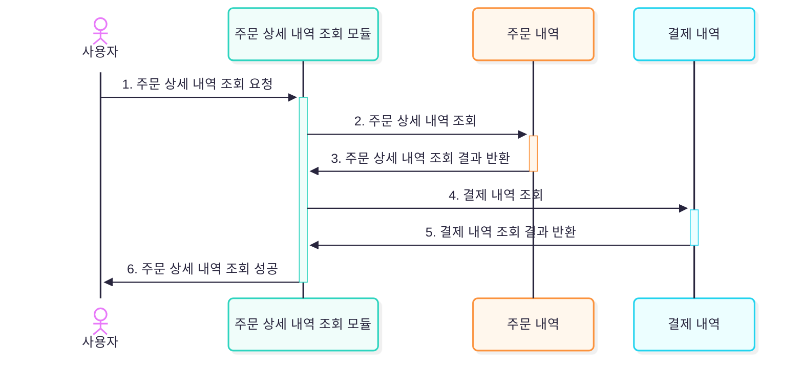

## 1-9 주문 결제

### 플로우 차트
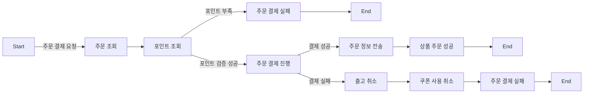

### 시퀀스 다이어그램
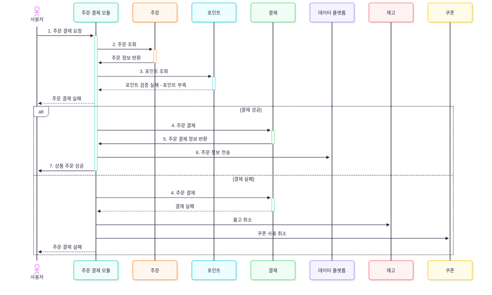

## 1-10 쿠폰 발급

### 플로우 차트
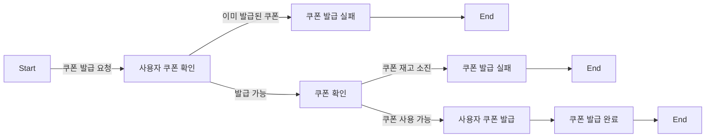

### 시퀀스 다이어그램
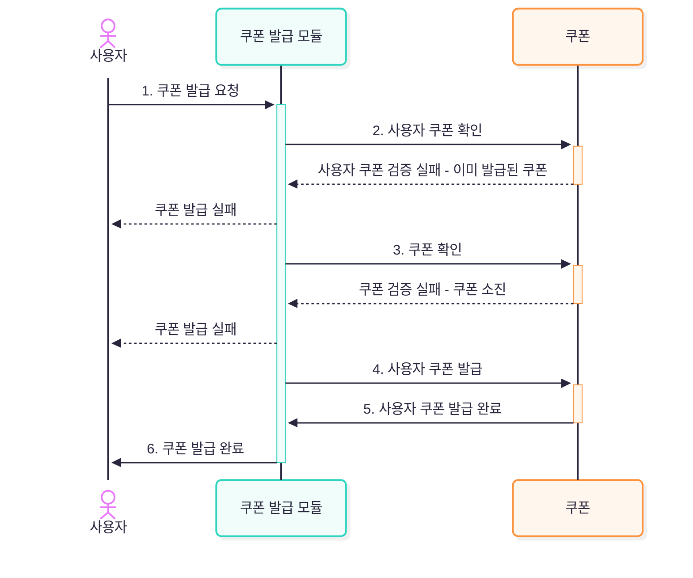

## 1-11 쿠폰 목록 조회

### 플로우 차트
```mermaid
flowchart LR
  A[Start] -- 유저 쿠폰 목록 조회 요청 --> B[유저 쿠폰 목록 조회]
  B --> C[유저 쿠폰 목록 조회 결과 반환]
  C --> D[유저 쿠폰 목록 조회 완료] --> E[End]
```

### 시퀀스 다이어그램
```mermaid
---
config:
  theme: redux-color
  look: neo
---
sequenceDiagram
actor 사용자
  사용자 ->>+ 유저 쿠폰 목록 조회 모듈: 1. 유저 쿠폰 목록 조회 요청
  유저 쿠폰 목록 조회 모듈 ->>+ 쿠폰: 2. 유저 쿠폰 목록 조회
  쿠폰 ->>- 유저 쿠폰 목록 조회 모듈: 3. 유저 쿠폰 목록 조회 결과 반환
  유저 쿠폰 목록 조회 모듈 ->>- 사용자: 4. 유저 쿠폰 목록 조회 완료

```